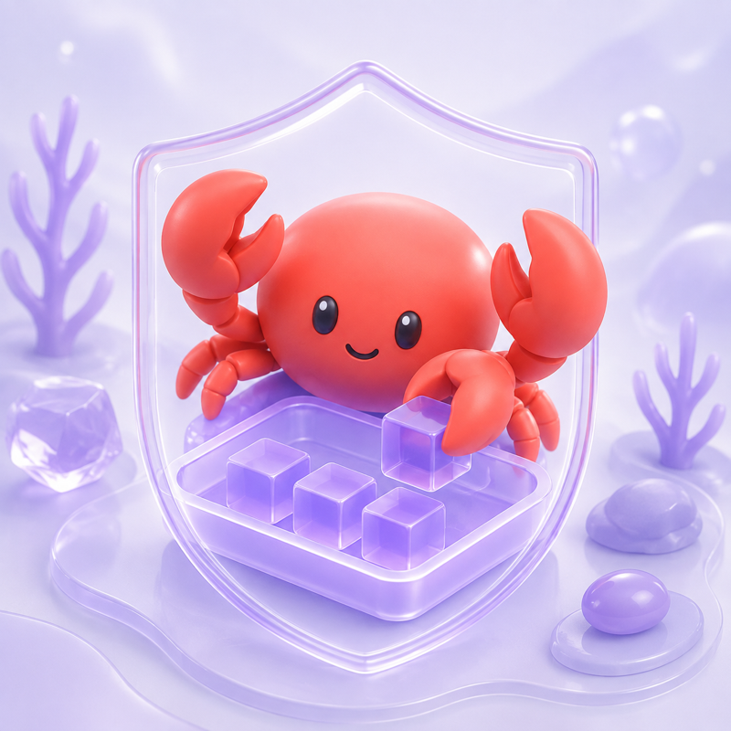
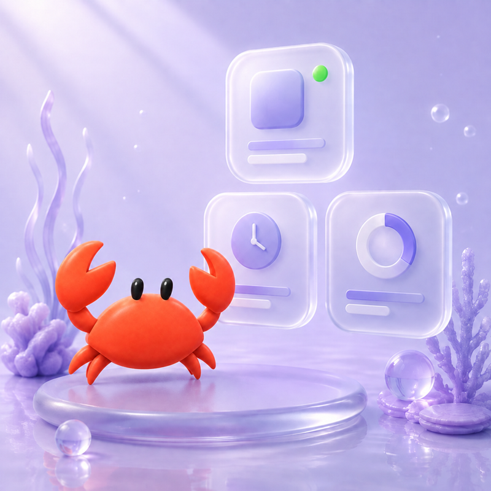

# Crab

**Stable Cleaning**

[English](README.md) | [简体中文](README.zh-CN.md)

<p align="center">
  
</p>

Crab is an open-source macOS utility focused on one job: safely cleaning and
managing storage created by AI applications and coding harnesses.

> Crab prioritizes data safety over reclaimed space. Nothing is selected
> automatically, unknown data is protected, and cleanup only moves explicitly
> confirmed items to the macOS Trash.

## Download

[**Download Crab v0.2.6 for Apple Silicon →**](https://github.com/qinthqod/Crab/releases/download/v0.2.6/Crab-0.2.6-macOS-arm64.dmg)

Crab requires Apple Silicon and macOS 14 or later. Before installing, you can
download the [SHA-256 checksum](https://github.com/qinthqod/Crab/releases/download/v0.2.6/SHA256SUMS.txt).
See [GitHub Releases](https://github.com/qinthqod/Crab/releases) for release notes
and all available versions.

> **First launch on macOS:** this public beta is ad-hoc signed and not Apple
> notarized. macOS may block the first launch even when the download is intact.
> Follow the [first-launch steps](#first-launch-on-macos) below after verifying
> the published SHA-256 checksum.

## Features

- **Cache Cleanup** — scans reviewed, regenerable cache leaves for installed AI
  desktop and command-line applications.
- **Application Management** — shows installed and running AI tools, recent use,
  available local usage metrics, and safe app-only uninstall.
- **Runtime Optimization** — checks whole-Mac disk, memory pressure, swap,
  uptime, thermal state, and sustained process load, then runs reviewed Quick
  Look and app-association maintenance. Finder and Dock refreshes stay optional;
  mounted disk images can be ejected only after confirmation. It never deletes
  files or automatically closes third-party applications.
- **Project Cleanup** — automatically discovers projects, associates them with AI
  applications, and lets the user move any selected project to Trash after a
  second confirmation.
- **Useful Labels** — projects unused for six months and projects at least 1 GB
  are labelled for attention; labels never auto-select or restrict them.
- **Bilingual UI** — follows the macOS language by default and supports an explicit
  Chinese or English preference.
- **In-app Updates** — checks Crab's official GitHub Release feed once when the
  app starts. A quiet top-right notice appears only when a verified newer
  version is available; clicking it directly verifies and installs the update.

Current rules cover installed products such as ChatGPT, Claude and Claude Code,
Cursor, Codex, DeepSeek Harness, Windsurf, TRAE, Zed, Ollama, and Doubao variants.
Products without a reviewed cache leaf are shown as protected instead of being
silently omitted.

<table>
  <tr>
    <th>Cache Cleanup</th>
    <th>Application Management</th>
    <th>Project Cleanup</th>
  </tr>
  <tr>
    <td></td>
    <td></td>
    <td></td>
  </tr>
</table>

## Repository Layout

```text
Sources/          SwiftUI app, shared safety core, CLI, and test harness
Rules/            Reviewed product-specific cache rules
Assets/Brand/     Source artwork bundled with the macOS application
Fixtures/         Non-production filesystem and rule fixtures
Packaging/        macOS application metadata
scripts/          Build, verification, smoke-test, and release scripts
docs/             Product, engineering, security, research, and specifications
.github/workflows Continuous integration
```

## Safety Contract

- No permanent deletion. Selected items are moved to Trash and remain recoverable
  until the Trash is emptied.
- No automatic selection or cleanup.
- Cache rules are exact reviewed leaves. Crab does not clean broad Application
  Support, chat, credential, model-weight, or download directories.
- Project roots are automatically associated with installed AI applications. Every
  selected root is revalidated immediately before execution.
- Changed identities, symbolic-link path chains, stale plans, and paths outside the
  approved boundary fail closed.
- Photos and Apple Music libraries are excluded from project inventory.
- No account, telemetry, analytics, upload, or cloud service is required.

The detailed contracts live in the [documentation index](docs/README.md), including
the [safe scan](docs/specs/safe-scan.md),
[project inventory](docs/specs/project-inventory.md), and
[project Trash execution](docs/specs/archive-trash-execution.md) specifications.

## Requirements

- macOS 14 or later
- Apple Silicon for the downloadable v0.2.6 beta
- Intel Macs can build Crab from source with a compatible Swift 6 toolchain
- Swift 6 toolchain for source builds

## Install the Public Beta

Download [`Crab-0.2.6-macOS-arm64.dmg`](https://github.com/qinthqod/Crab/releases/download/v0.2.6/Crab-0.2.6-macOS-arm64.dmg)
and [`SHA256SUMS.txt`](https://github.com/qinthqod/Crab/releases/download/v0.2.6/SHA256SUMS.txt),
verify the checksum, open the disk image, and drag `Crab.app` onto the
`Applications` shortcut. Eject the Crab disk image after copying finishes.

Version 0.1.1 added user-confirmed updates inside Crab. Because 0.1.0 did not contain
the installer, upgrading from 0.1.0 to 0.1.1 is the final manual update. Later
compatible releases can be installed directly from the update notice on the Crab
home screen or from Settings.

### First launch on macOS

The beta is ad-hoc signed and is not notarized. As a result, Gatekeeper may show
“Apple could not verify Crab is free of malware” on the first launch. This is a
macOS verification warning, not an application crash.

After verifying that the downloaded file matches the published SHA-256 checksum:

1. Drag `Crab.app` from the disk image into `Applications`.
2. Try to open Crab once. If macOS blocks it, choose **Done**.
3. Open **System Settings → Privacy & Security**.
4. In the Security section, find the message that Crab was blocked and choose
   **Open Anyway**.
5. Confirm **Open**. Later launches should open normally.

On some macOS versions, you can instead Control-click Crab in Applications,
choose **Open**, and then confirm **Open**. Do not continue if the checksum does
not match the value published in the official Crab release.

## Build from Source

```bash
git clone https://github.com/qinthqod/Crab.git
cd Crab
swift run crab-core-tests
./scripts/build-app-bundle.sh
open build/Crab.app
```

Build a drag-to-install DMG, the ZIP used by in-app updates, and their checksum
file:

```bash
./scripts/package-release.sh
```

## CLI

The CLI is intentionally read-only: it validates rules, scans reviewed cache leaves,
and creates immutable plans. It has no clean command and accepts no arbitrary cleanup
path.

```bash
swift run crab --help
swift run crab rules validate Fixtures/Rules/example.json
swift run crab scan --rules Fixtures/Rules --home Fixtures/Home

# Empty selection is the safe default.
swift run crab plan \
  --rules Fixtures/Rules \
  --home Fixtures/Home \
  --output /tmp/crab-empty-plan.json
```

## Development

```bash
swift run crab-core-tests
swift build -c release
bash scripts/check-dangerous-apis.sh
```

The native application is implemented in SwiftUI. Architecture, product, security,
and research documents are organized under [`docs/`](docs/README.md).

See [CONTRIBUTING.md](CONTRIBUTING.md) before proposing an application rule or a
change to cleanup behavior. Security issues should follow [SECURITY.md](SECURITY.md).

## License

Crab is available under the [MIT License](LICENSE).
